# Spark SQL
Documentación:  
https://spark.apache.org/docs/latest/sql-programming-guide.html


El módulo Spark SQL consta de dos partes principales.
El primero son las representaciones de las API de estructura denominadas DataFrame y Dataset que definen las API de alto
nivel para trabajar con datos estructurados.

La segunda parte del módulo Spark SQL es el optimizador Catalyst, que es responsable de toda la maquinaria compleja que
funciona detrás de escena para facilitarle la vida y, en última instancia, acelerar su lógica de procesamiento de datos.

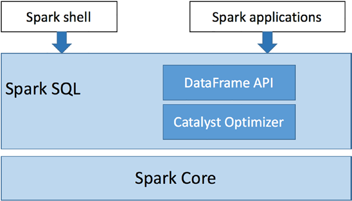

## SQL Join Types
* Inner join
* Full join
* Left join
* Right join

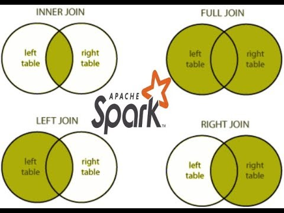

````scala
package org.example

import org.apache.spark.sql.SparkSession

case class Employee(i: Int, str: String)
case class Department(i: Int, str: String)

object Joins extends App {
  //IdDepartment, name
  val employees = Seq(
    Employee(20, "Andrea"),
    Employee(30, "Jorge"),
    Employee(40, "Maria"),
    Employee(50, "Pedro"))

  //IdDepartment, name
  val departments = Seq(
    Department(10, "IT"),
    Department(20, "Sales"),
    Department(30, "Marketing"))

  val spark = SparkSession.builder().master("local[*]").getOrCreate();
  val sc = spark.sparkContext
  val employeesRDD = sc.parallelize(employees)
  val departmentsRDD = sc.parallelize(departments)

  val employeesDF = spark.createDataFrame(employeesRDD)
  val departmentsDF = spark.createDataFrame(departmentsRDD)
  println("Employees:")
  employeesDF.printSchema()
  employeesDF.show()

  println("Departments:")
  departmentsDF.printSchema()
  departmentsDF.show()

  println("Inner Join:")
  employeesDF.join(departmentsDF, employeesDF.col("i") === departmentsDF.col("i"), "inner")
    .show(false)

  println("Full Join:")
  employeesDF.join(departmentsDF, employeesDF.col("i") === departmentsDF.col("i"), "full")
    .show(false)

  println("Left Join:")
  employeesDF.join(departmentsDF, employeesDF.col("i") === departmentsDF.col("i"), "left")
    .show(false)

  println("Right Join:")
  employeesDF.join(departmentsDF, employeesDF.col("i") === departmentsDF.col("i"), "right")
    .show(false)

  sc.stop()
}
````


## Semi Structured Data
### Tipos de datos

Por su origen y características, los datos suelen clasificarse en las siguientes categorías:
* Estructurados: Son aquellos que tienen campos fijos y, por tanto, se especifican al detalle. Un ejemplo de ello, es una base de datos SQL de clientes
* Semi-Estructurados: Suelen tener un formato que puede ser definido, pero no es fácil su comprensión por el usuario y requiere habitualmente
  el uso de reglas complejas que ayuden a determinar cómo leer cada pieza de la información.
* No estructurados: Identifican a aquellos que no tienen ningún tipo predefinido. Normalmente, su estructura no es uniforme y se tiene habitualmente poco y nulo control sobre ellos.

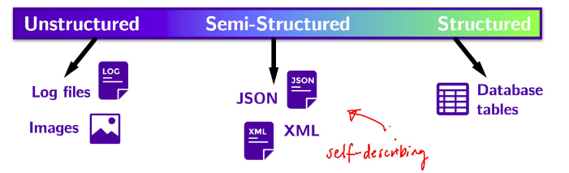

### DataFrame

Son datos organizados en columnas, como una tabla en  base de datos relacionales llevando los datos a un nivel de abstracción más alto

* Spark SQL brinda funciones de selección, filtrado, agregación de columnas, así como unión de varios DataSet.
* Se optimiza a través de Catalyst, pasando por cuatro etapas:
    * Análisis de un plan lógico para resolver las referencias.
    * Optimización del plan lógico.
    * Planificación física.
    * Generación de código para compilar en Java Bytecode.

### Catalyst Optimizer

Se basa en construcciones de programación funcional en Scala admitiendo la optimización tanto en reglas como en costo
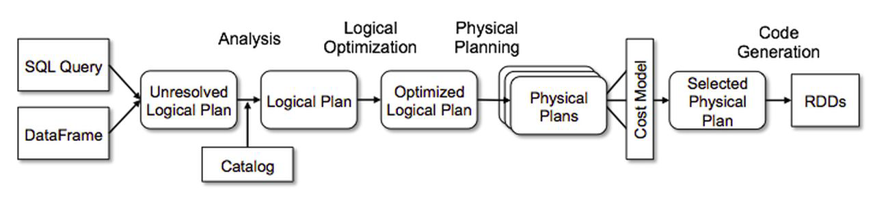

### DataSet
Es una extensión del DataFrame que proporciona una interfaz de programación orientada a objetos.
* Type-safe
* Aprovecha el optimizador Catalyst de Spark
* Representa datos en forma de objetos JVM de fila o una colección de
  objetos de fila.

Ejemplo con spark-shell
```scala
import scala.util.Random

val rdd = spark.sparkContext.parallelize(1 to 10).map(x => (x, Random. nextInt(100)* x))
val kvDF = rdd.toDF("key","value")
kvDF.printSchema
kvDF.show
```
Ejemplo 
````scala
package org.example

import org.apache.spark.sql.SparkSession

case class Employee(i: Int, str: String)
case class Department(i: Int, str: String)

object Main extends App {
  println("Hello World!")
  val employees = Seq(
    Employee(20, "Andrea"),
    Employee(30, "Jorge"),
    Employee(40, "Maria"),
    Employee(50, "Pedro"))

  val departments = Seq(
    Department(10, "IT"),
    Department(20, "Sales"),
    Department(30, "Marketing"))

  val spark = SparkSession.builder().master("local[*]").getOrCreate();
  val sc = spark.sparkContext
  val employeesRDD = sc.parallelize(employees)
  val departmentsRDD = sc.parallelize(departments)

  val employeesDF = spark.createDataFrame(employeesRDD)
  val departmentsDF = spark.createDataFrame(departmentsRDD)
  println("Employees:")
  employeesDF.printSchema()
  employeesDF.show()

  println("Departments:")
  departmentsDF.printSchema()
  departmentsDF.show()
  
  sc.stop()
}
````

## Aggregation, Transformations and Actions
### Funciones de agregación

Las funciones de agregación realizan operaciones específicas en una o más columnas de un `DataFrame` para un conjunto de
registros y regresan un nuevo `DataFrame` como resultado. Estas se encuentran definidas en el paquete `org.apache.spark.sql.functions`
* `approx`
* `count`
* `distint`
* `max`
* `min`
* `avg`
* `first`
* `last`
* `sum`

Ejemplo
````scala
package org.example

import org.apache.spark.sql.SparkSession

import org.apache.spark.sql.functions.{max, min, count, avg, sum}

case class Product(pId: Int, name: String, price: Double, cost: Double)
object Agregacion extends App {

  val productos = Seq(
    Product(1, "Iphone", 600, 400),
    Product(2, "Galaxy", 500, 400),
    Product(3, "Ipad", 400, 300),
    Product(4, "Kindle", 200, 100),
    Product(5, "Macbook", 1200, 900),
    Product(6, "Dell", 500, 400)
  )
  val spark = SparkSession.builder().master("local[*]").getOrCreate();
  val sc = spark.sparkContext
  val rdd = sc.parallelize(productos)
  val df = spark.createDataFrame(rdd)
  println("Máximo precio por producto")
  val r1 = df.agg(max("price"))
  r1.show()
  println("Minimo precio por producto")
  val r2 = df.agg(min("price"))
  r2.show()
  println("Conteo de productos")
  val r3 = df.agg(count("pId"))
  r3.show()
  println("Promedio precio por producto")
  val r4 = df.agg(avg("price"))
  r4.show()
  println("Suma de precio por producto")
  val r5 = df.agg(sum("price"))
  r5.show()
}
````

### Transformaciones

Una transformación en Spark es una función que produce una nueva estructura a partir de una o más estructuras 
(RDD/Dataframe/Dataset). Las transformaciones son lazy (perezosas), es decir, se ejecutarán hasta que llamemos a una 
acción, por lo que no se ejecutarán inmediatamente.

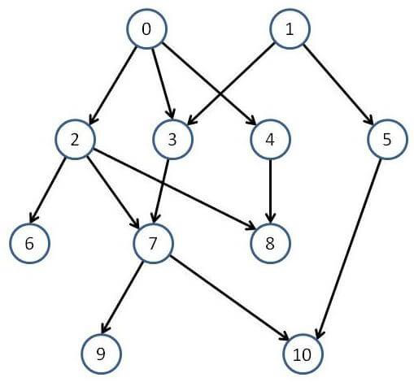

Las transformaciones no se realizan de inmediato; más bien, se crea un DAG (Gráfico Acíclico Dirigido) que se seguirá
construyendo hasta que se aplique una operación de acción “por ello las transformaciones son operaciones llamadas lazy”.

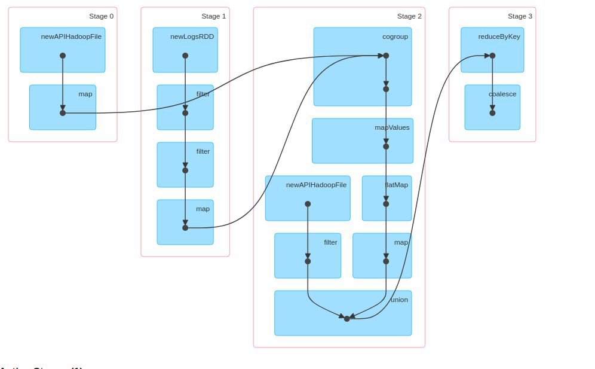

### Tipos de transformaciones
Existen dos tipos de transformaciones:
* Transformaciones limitadas (narrow): Todos los elementos que se necesitan
para procesar cada registro, viven en la misma partición y no es necesario
mezclarlos.
* Transformaciones amplias (wide): Todos los elementos que se necesitan para
  procesar cada registro viven en diferentes particiones y surge la necesidad de
  mezclarlos para realizar agrupaciones o cálculos sobre los mismos. 

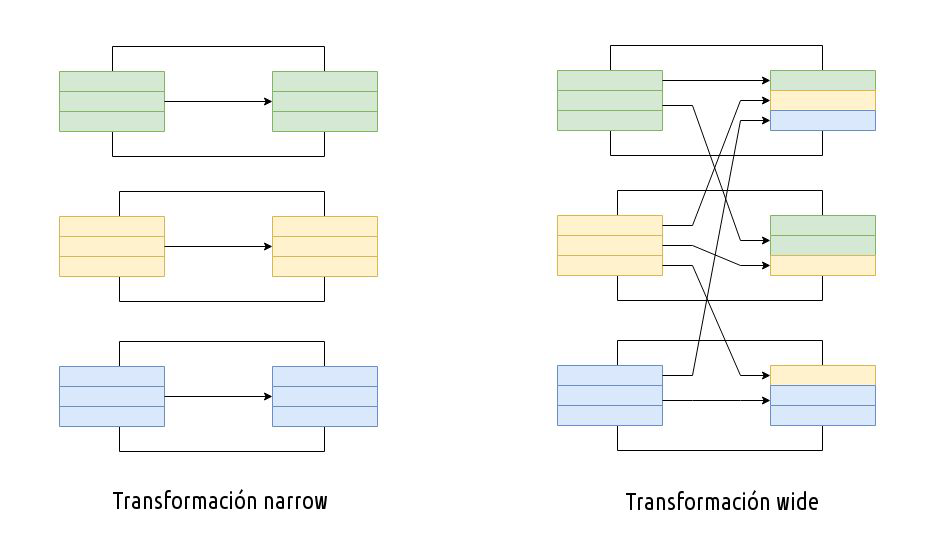

Ejemplos de transformaciones limitadas
* Map
* FlapMap
* Filter
* Sample
* Union 

Ejemplo de transformaciones amplias
* ReduceByKey
* GroupByKey
* Join
* Distinct

### Acciones

En Spark, las acciones son operaciones que no devuelven una estructura de Spark
como pasa en las transformaciones, por ejemplo al ejecutar una acción un nuevo
DataFrame no es creado. En su lugar, el resultado de las transformaciones lazy es
solicitado por una acción y es almacenado en el driver o en un sistema de
almacenamiento externo.

### Pipelining

La evaluación diferida permite que Spark optimice todo el flujo de cálculos en lugar
de las piezas individuales. Esto lo hace excepcionalmente rápido para ciertos tipos de
cálculo porque puede realizar todos los cálculos relevantes a la vez. Técnicamente
hablando, Spark canaliza este cálculo, que podemos ver en la imagen a continuación.
Esto significa que ciertos cálculos se pueden realizar todos a la vez (como un mapa y
un filtro), en lugar de tener que hacer una operación para todos los datos y luego la
siguiente operación. Además, Apache Spark puede mantener los resultados en la
memoria a diferencia de otros marcos que escriben inmediatamente en el disco
después de cada tarea.

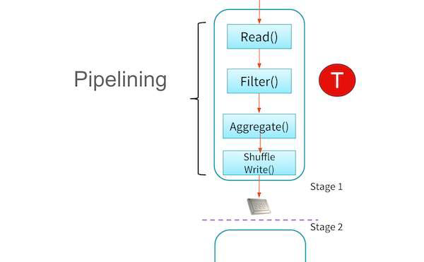

## Operadores relacionales

### Definición
* Son símbolos que se usan para comparar dos valores
* Si el resultado de la comparación es correcto la expresión considerada es
verdadera, en caso contrario es falsa

````scala
val a = 10
val b = 5
a < b //   a es menor que b
a > b //   a es mayor que b
a === b // a es igual a b
a =!= b // a es diferente de b
a <= b //  a es menor o igual a b
a >= b //  a es mayor o igual a b
````
### Expresiones Relacionales
* Las expresiones que contienen operadores
relacionales se denominan expresiones relacionales.
* El resultado de la expresión relacional es
siempre del tipo cierto o falso, es decir, producen un resultado booleano.

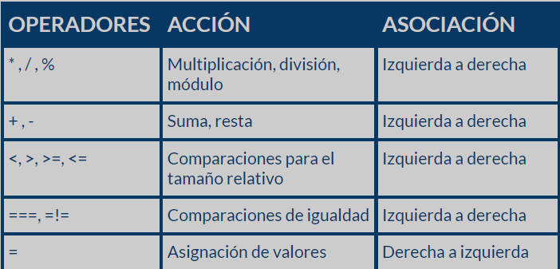

### DataFrames
En Spark puedes operar un DataFrame de dos formas:
1. Usando sentencias SQL
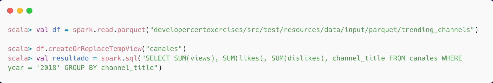

2. Usando las funciones nativas de Spark
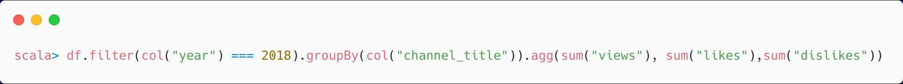

## UDF'x & UDAF's

### UDF
Las funciones definidas por el usuario (UDF) son rutinas programables por el usuario que actúan en una fila.

https://spark.apache.org/docs/latest/sql-ref-functions-udf-scalar.html

### UDAF
Las funciones agregadas definidas por el usuario (UDAF) son rutinas programables por el usuario que actúan en varias filas a la vez y devuelven un único valor agregado como resultado.

https://spark.apache.org/docs/latest/sql-ref-functions-udf-aggregate.html

## Funciones de ventana
Las funciones de ventana calculan un valor para cada registro de una tabla basado en un  conjunto  de  registros  de  entrada  llamado  ventana  (window  specification), permitiendo a los usuarios procesar tareas que sin window functions puede resultar difícil.
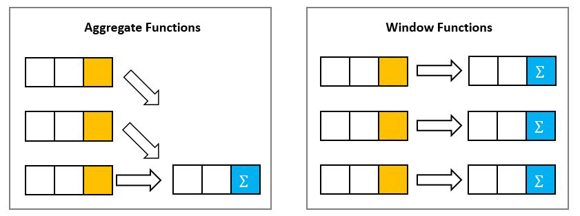

Spark SQL soporta 3 tipos de funciones de ventana

Ranking
* rank
* dense_rank
* percent_rank
* ntile
* row_number

Analytic
* cume_dist
* first_value
* last_value
* lag
* lead

Aggregate
* avg
* max
* min
* sum
* first
* last

https://spark.apache.org/docs/latest/sql-ref-syntax-qry-select-window.html

## Buenas prácticas

### Manejo de memoria y disco
NOTA: Al realizar procesos con Spark es importante tener en mente que los datos
son procesados en RAM. En caso de no ser suficiente, se hará uso del
almacenamiento en disco para almacenar operaciones y/o consultas de datos.
Algunas acciones a tomar en cuenta son las siguientes:
1. Analizar recursos y sentencias altamente utilizados.
2. Analizar con mucho cuidado la ejecución de las sentencias “cache” o “persist”, ya
   sea con el fin de forzar la ejecución de las evaluaciones “lazy”, o para forzar la
   carga de datos en memoria.
3. Evitar que en RAM se estén cargando datos excesivamente grandes.
4. Liberar los recursos reservados al terminar de utilizarlos.

### Análisis de recursos y consultas más utilizadas

Es importante identificar tanto los datos como las consultas que más se usan, debido
a que estos podrían ser persistidos en algún nivel de almacenamiento (RAM, disco o
ambos), minimizando así el impacto de recalcular los datos en cada operación.
Se recomienda hacer un análisis exhaustivo de la volumetría y tamaño de los
insumos, así como el tipo de transformaciones y/o acciones que se realizan con ellos
para identificar el adecuado uso de funciones como repartition y/o broadcast.

### Optimizar el uso de las sentencias “cache” y “persist”

En algunas ocasiones se observa en los desarrollos una sentencia cache seguida de
un count para forzar que en ese momento se obtenga un DataFrame y se cargue en
RAM. Se recomienda evitar hacer uso de estas operaciones.
En su lugar es preferible conservar únicamente la sentencia de persistencia y dejar
que los cálculos y carga en el nivel de almacenamiento sea realizado en la primera
acción.

### Evitar que la memoria RAM se sature

Cuando se utiliza de forma indiscriminada las sentencias “cache” y/o “persist” se
corre el riesgo de saturar la RAM, lo que se verá reflejado en un mal desempeño en
cuanto al tiempo de ejecución del procesamiento.
Las políticas de reemplazo de caché que maneja Spark (LRU policies), provoca que
los datos sean retirados de RAM, enviados a disco y posteriormente disponibilizados
en RAM cuando sean utilizados.

### Liberar los recursos reservados al terminar de utilizarlos

Cuando se hace uso de las sentencias de persistencia en objetos de tipo DataFrame,
es necesario hacer el llamado del método “unpersist” al terminar de utilizarlos, esto
con el fin de permitir que Spark pueda liberar, y así disponer de memoria RAM para
poder efectuar tareas subsecuentes.

### Manejo adecuado y oportuno de sentencias cache y persist

La sentencia “cache” tiene un StorageLevel de tipo RAM y almacenamiento en disco
de forma deserializada. Por otro lado, la sentencia “persist” nos permite configurar el
StorageLevel en el que serán persistidos los datos (RAM, disco o ambos), así como el
comportamiento de serialización.
Se puede llegar a la conclusión de que se deberá usar una sentencia u otra después
de entender el comportamiento que tiene en cada API, así como las necesidades que
se tengan, en lugar de que simplemente se utilice la función “cache” para “persistir” la
información.

### Uso de métodos nativos de Spark

Spark proporciona una amplia serie de métodos para realizar tareas, las cuales son
fácilmente optimizables por Catalyst Optimizer.
Como parte de las buenas prácticas es importante revisar si las operaciones que
deseamos realizar son soportadas y se adaptan al requerimiento.

### Estructuración de código y uso de sentencias
exploratorias
Cuando se desarrolla un procesamiento, es común ejecutar ciertas operaciones de
carácter exploratorio, las cuales a la hora de productivizar permanecen en el código
que se quiere enviar a producción. Algunos ejemplos implican tener:
1. Código comentado dentro de las clases.
2. Uso de sentencias exploratorias ejecutándose de manera recurrente.
3. Reasignación de variables.
4. Código repetido

### Código comentado dentro de las clases
Tener código que no se ejecuta durante el procesamiento impacta de forma negativa
en su mantenimiento, cuando se trata de proyectos realizados en un arquetipo o
plantilla.
Cuando hablamos de proyectos codificados en notebooks, el impacto es mucho
mayor puesto que una persona ajena al desarrollo no cuenta con una forma práctica
de saber si ese código realmente no se debe de ejecutar, o si algún otro desarrollador
ha olvidado quitarlo.

### Sentencias exploratorias recurrentes

Durante los procesos de descubrimiento y análisis de los proyectos es muy común
ver sentencias del tipo “show” para poder observar los datos, lo cual resulta válido
para el propósito de observar con mayor nivel de detalle el flujo de trabajo que se
está ejecutando durante el desarrollo del procesamiento. Sin embargo, el problema
viene cuando estas sentencias se mantienen en el código que se quiere enviar a
entornos productivos.

### Reasignación de variables
Re-asignar variables en el código puede impactar de forma negativa en el
mantenimiento y/o depuración del mismo, puesto que requiere de un esfuerzo
mayor para obtener y determinar la trazabilidad del valor.

### Reutilización de bibliotecas y código existente
La reutilización de bibliotecas disponibles se recomienda ampliamente ya que ayuda
a disminuir el código escrito en un proyecto, así como enfocar los esfuerzos en la
implementación de los requerimientos nuevos.

### Implementemos AMLib